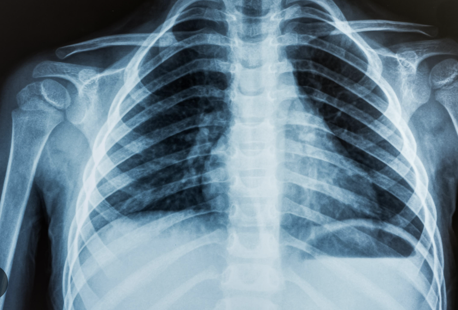

## Overview

This Terraform configuration sets up an AWS-based serverless pipeline for classifying medical images using Amazon Rekognition. It provisions four S3 buckets dedicated to storing different types of medical images—X-ray, CT scan, general use—and a source bucket that triggers image classification. When new images are uploaded to the source bucket, a Lambda function is invoked to analyze them. The results can be used for routing images to specific destination buckets based on content type or classification confidence.

## Infrastructure Components

The setup includes an AWS Lambda function named `imageClassifier`, which uses a Python 3.9 runtime and is deployed using source code stored in an S3 bucket (provided via variables). The Lambda function is granted necessary permissions through IAM roles and policy attachments, enabling it to access Amazon Rekognition and Amazon S3. The function environment is configured with target bucket names and a confidence level threshold, allowing dynamic behavior based on image analysis results.

## Trigger and Permissions

An S3 event notification is configured to invoke the Lambda function automatically whenever a new object is created in the source bucket. The configuration ensures proper IAM permissions for the Lambda to be triggered by S3 and access the required AWS services. This infrastructure is designed to be modular, scalable, and applicable in scenarios like medical image triaging, research, or automated sorting of clinical data.

## Input
 

| Name                     | Description                                             | Type   | Default | Required |
|--------------------------|---------------------------------------------------------|--------|---------|----------|
| `aws_region`             | AWS Region to deploy resources                          | string | n/a     | ✅        |
| `xray_bucket`            | Name of the X-Ray bucket                                | string | n/a     | ✅        |
| `ctscan_bucket`          | Name of the CT Scan bucket                              | string | n/a     | ✅        |
| `general_bucket`         | Name of the General bucket                              | string | n/a     | ✅        |
| `source_bucket`          | The S3 source bucket                                    | string | n/a     | ✅        |
| `lambda_code_s3_bucket`  | The S3 bucket where the zipped Lambda code is stored    | string | n/a     | ✅        |
| `lambda_code_s3_key`     | The S3 key (path) to the zipped Lambda code file        | string | n/a     | ✅        |
| `confidence_level`       | Confidence level for Rekognition detection              | number | `90`    | ✅        |
